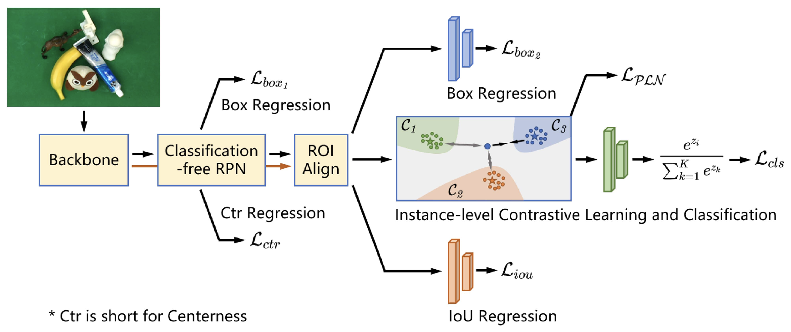

# Openset-RCNN

This is the official pytorch implementation of our RA-L paper "Open-Set Object Detection Using Classification-Free Object Proposal and Instance-Level Contrastive Learning".

Authors: Zhongxiang Zhou, Yifei Yang, Yue Wang, Rong Xiong \
[Paper](https://ieeexplore.ieee.org/document/10035923) | [Project Page](https://sites.google.com/view/openest-rcnn/)

## Abstract

Detecting both known and unknown objects is a fundamental skill for robot manipulation in unstructured environments. Open-set object detection (OSOD) is a promising direction to handle the problem consisting of two subtasks: objects and background separation, and open-set object classification. In this letter, we present Openset RCNN to address the challenging OSOD. To disambiguate unknown objects and background in the first subtask, we propose to use classification-free region proposal network (CF-RPN) which estimates the objectness score of each region purely using cues from object’s location and shape preventing overfitting to the training categories. To identify unknown objects in the second subtask, we propose to represent them using the complementary region of known categories in a latent space which is accomplished by a prototype learning network (PLN). PLN performs instance-level contrastive learning to encode proposals to a latent space and builds a compact region centering with a prototype for each known category. Further, we note that the detection performance of unknown objects can not be unbiasedly evaluated on the situation that commonly used object detection datasets are not fully annotated. Thus, a new benchmark is introduced by reorganizing GraspNet-1billion, a robotic grasp pose detection dataset with complete annotation. Extensive experiments demonstrate the merits of our method. We finally show that our Openset RCNN can endow the robot with an open-set perception ability to support robotic rearrangement tasks in cluttered environments.

## Model



## Installation

```sh
conda create -n osrcnn python=3.8
conda activate osrcnn

conda install pytorch==1.10.0 torchvision==0.11.0 torchaudio==0.10.0 cudatoolkit=11.3 -c pytorch -c conda-forge

python -m pip install detectron2 -f https://dl.fbaipublicfiles.com/detectron2/wheels/cu113/torch1.10/index.html

conda install numpy=1.19

pip uninstall setuptools
pip install setuptools==59.5.0
```

## Data

### VOC-COCO

This dataset is proposed by [OpenDet](https://github.com/csuhan/opendet2). Please follow the [instruction](https://github.com/csuhan/opendet2/blob/main/datasets/README.md) for dataset preparation. Then generate VOC-COCO datasets.

```sh
bash datasets/opendet2_utils/prepare_openset_voc_coco.sh
```

### GraspNet

Download train and test images of [GraspNet-1Billion](https://graspnet.net/datasets.html). Unzip and put them under `datasets/graspnet`. Download [annotation files](https://drive.google.com/drive/folders/1mT_MIhleHzEQHJprN2Y_K8gVrF5A79w9?usp=share_link) and put under `datasets/graspnet_os/annotations`. Then run script to organize the images:

```sh
bash datasets_remote/openset_rcnn_utils/prepare_graspnet_osod.sh
```

Expected dataset structure:

```
graspnet_os\
  annotations\
    graspnet_os_train.json
    graspnet_os_test_{1,2,3,4,5,6}.json
  images\
    000001.png
    000002.png
    000003.png
    000004.png
    ...
```

## Train and Test

### Train

- VOC-COCO

```sh
python train.py \
--config-file configs/VOC-COCO/openset_rcnn_R50_FPN_128k.yaml \
--opendet-benchmark \
OUTPUT_DIR output_dir
```

- GraspNet

```sh
python train.py \
--config-file configs/GraspNet/openset_rcnn_R50_FPN_128k.yaml \
OUTPUT_DIR output_dir
```

### Test

- VOC-COCO

```sh
python train.py \
--config-file configs/VOC-COCO/openset_rcnn_R50_FPN_128k.yaml \
--eval-only \
--opendet-benchmark \
MODEL.WEIGHTS path/to/checkpoint \
OUTPUT_DIR output_dir
```

- GraspNet

```sh
python train.py \
--config-file configs/GraspNet/openset_rcnn_R50_FPN_128k.yaml \
--eval-only \
MODEL.WEIGHTS path/to/checkpoint \
OUTPUT_DIR output_dir
```

## Model Zoo

### VOC-COCO Benchmark

| Model        |  WI   | AOSE  | $\text{AP}_\text{k}$ | $\text{AR}_\text{unk}$ | config & checkpoint |
| :----------- | :---: | :---: | :---: | :---: | :---: |
| Openset RCNN | 11.52 | 10376 | 59.12 | 53.70 | [config](configs/VOC-COCO/openset_rcnn_R50_FPN_128k.yaml) [model](https://drive.google.com/file/d/1ysRJXBhL9PXKC-7xvxBCU42GCiMC5-hG/view?usp=share_link) |

### GraspNet Benchmark

| Model        |  WI   | AOSE  | $\text{AP}_\text{k}$ | $\text{AP}_\text{unk}$ | config & checkpoint |
| :----------- | :---: | :---: | :---: | :---: | :---: |
| Openset RCNN | 0.06 | 22843 | 69.03 | 41.72 | [config](configs/GraspNet/openset_rcnn_R50_FPN_128k.yaml) [model](https://drive.google.com/file/d/1Hrf59DsGd8_RcoBN-VOIZWjZ7AFozaWE/view?usp=share_link) |

## Citation

If you find our code or paper useful, please cite as

```bibtex
@article{zhou2023open,
  title={Open-Set Object Detection Using Classification-Free Object Proposal and Instance-Level Contrastive Learning},
  author={Zhou, Zhongxiang and Yang, Yifei and Wang, Yue and Xiong, Rong},
  journal={IEEE Robotics and Automation Letters},
  volume={8},
  number={3},
  pages={1691--1698},
  year={2023},
  publisher={IEEE}
}
```

## Acknowledgement

Many thanks to these excellent open source projects:
- [detectron2](https://github.com/facebookresearch/detectron2/tree/main)
- [OpenDet](https://github.com/csuhan/opendet2)
- [OLN](https://github.com/mcahny/object_localization_network)